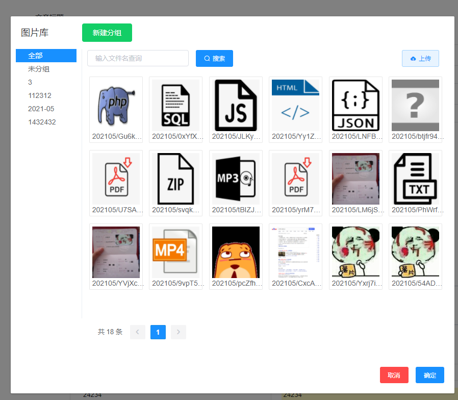
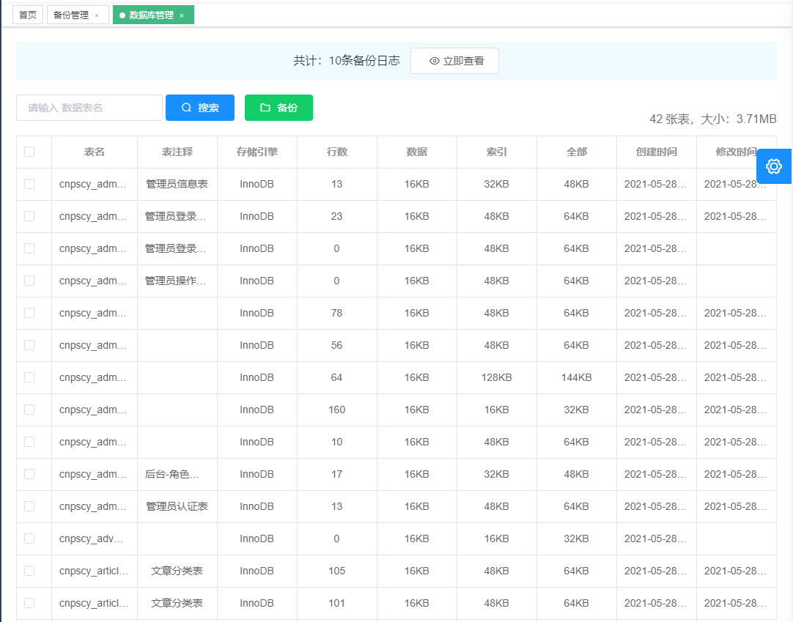
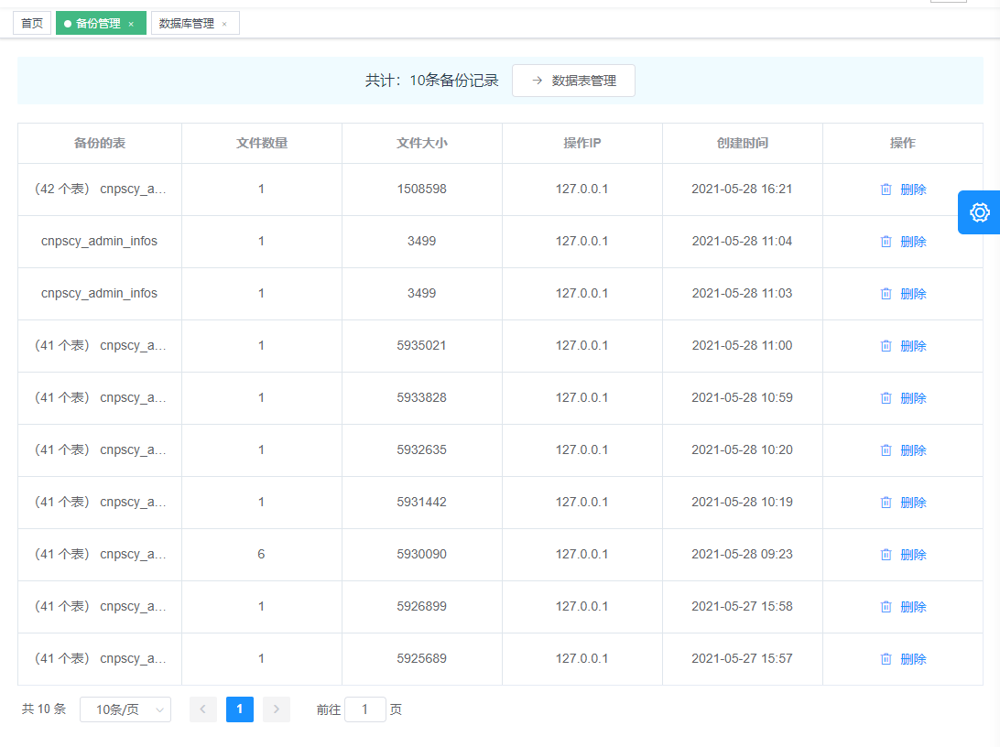

# laravel-vue-admin

## 作者
[小丑路人](https://www.cnpscy.com)

#### Description

[demo](http://laravel-vue-admin.cnpscy.com/admin)








#### Software Architecture
Software architecture description

#### Installation

###### 安装Vue
* 安装 npm 包：`npm install`
* 热更新vue项目：`npm run watch-poll`

    - vue无法执行：可尝试：
        - npm rebuild node-sass
    
###### PHP设置
* 命令行：`composer install`
* 命令行：`cp .env.example .env`
* 命令行，生成 APP_KEY：`php artisan key:generate`
* 命令行，JWT的key：`php artisan jwt:secret`
* 导入根目录sql：laravel-vue-admin.sql
* 定时任务：
    - 自动按月分表：`php artisan command:autotablebuild`
    - 或者使用任务调度：`php artisan schedule:run`

###### 站点配置

- 站点解析目录：`public`
- 访问网址：`你的域名/admin`

#### Instructions

1.  按月、按年分表的模型，皆不可使用 `with`，可使用 `load` 代替,`static::query` 会重新 实例化当前模型，之前设置的分表名称将被替换。
    
    具体原因看代码：
```php
    /**
     * Begin querying a model with eager loading.
     *
     * @param  array|string  $relations
     * @return \Illuminate\Database\Eloquent\Builder
     */
    public static function with($relations)
    {
        return static::query()->with(
            is_string($relations) ? func_get_args() : $relations
        );
    }

    ······

    /**
     * Begin querying the model.
     *
     * @return \Illuminate\Database\Eloquent\Builder
     */
    public static function query()
    {
        return (new static)->newQuery();
    }
```

#### Contribution

1.  Fork the repository
2.  Create Feat_xxx branch
3.  Commit your code
4.  Create Pull Request

#### 捐助


.jpg")