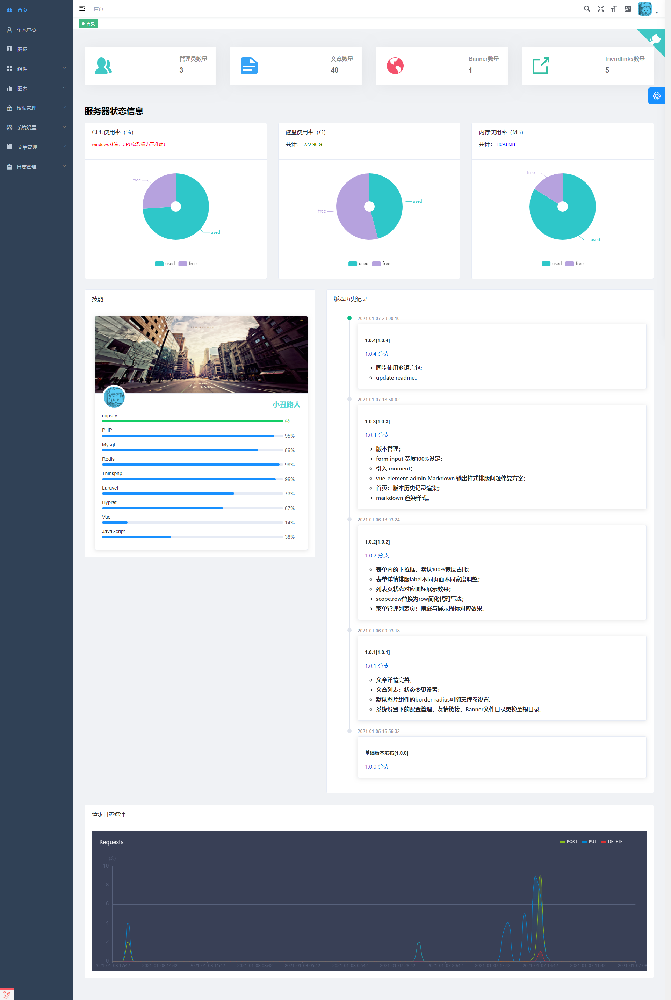
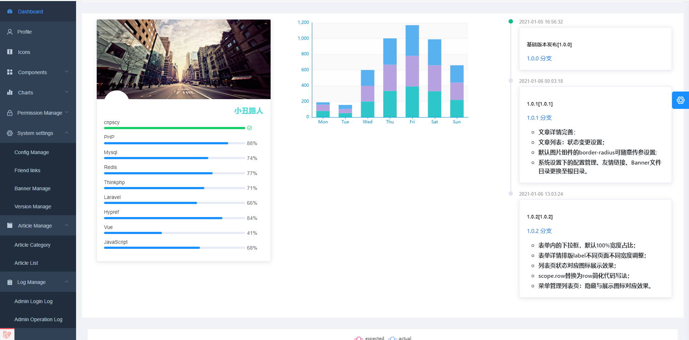
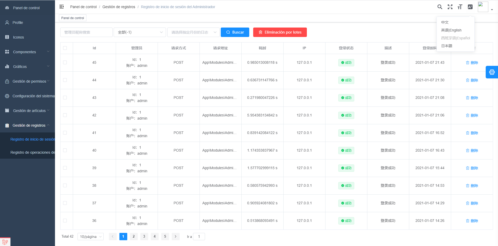
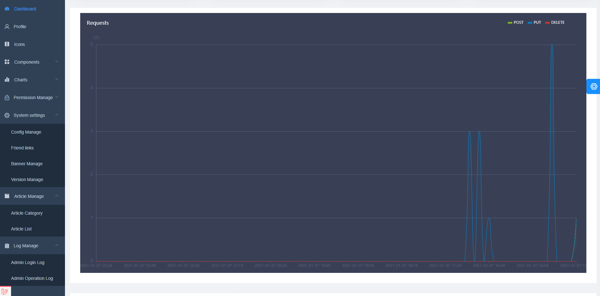

# laravel-vue-admin

#### Description
<a href="https://gitee.com/clown-passerby-community/laravel-vue-admin">laravel+vue-element-admin</a>

#### Software Architecture
Software architecture description

#### Installation

* 命令行：`composer install`
* 命令行：`cp .env.example .env`
* 命令行，生成 APP_KEY：`php artisan key:generate`
* 命令行，JWT的key：`php artisan jwt:secret`
* 导入根目录sql：laravel-vue-admin.sql
* 任务调度：`php artisan schedule:run`

#### Instructions

1.  xxxx
2.  xxxx
3.  xxxx

#### Contribution

1.  Fork the repository
2.  Create Feat_xxx branch
3.  Commit your code
4.  Create Pull Request

#### 捐助

.jpg")

#### Gitee Feature

1.  You can use Readme\_XXX.md to support different languages, such as Readme\_en.md, Readme\_zh.md
2.  Gitee blog [blog.gitee.com](https://blog.gitee.com)
3.  Explore open source project [https://gitee.com/explore](https://gitee.com/explore)
4.  The most valuable open source project [GVP](https://gitee.com/gvp)
5.  The manual of Gitee [https://gitee.com/help](https://gitee.com/help)
6.  The most popular members  [https://gitee.com/gitee-stars/](https://gitee.com/gitee-stars/)
